# Frontend for Movie Reservation System

## Built with:
- TypeScript
- React
- Vite

## Installation:
- Navigate to project directory and install dependencies:
```
npm install
```
- To run the app (UI Only):
```
npm run dev
```
- To build the project:
```
npm run build
```
- Build files will be generated at ${PROJECT_DIR}/dist/
- To run the app along with the backend system, build this project and follow the instructions to launch the backend as mentioned [here](https://github.com/loveleenc/movie-system-backend)

## Screenshots

### Homepage
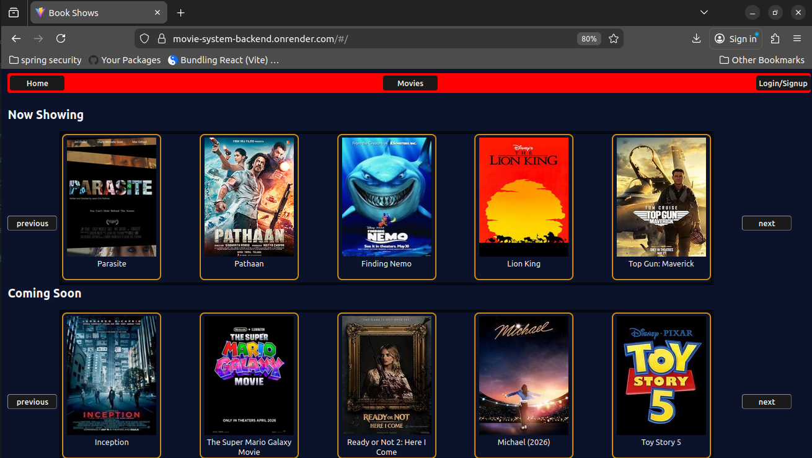

### Movies section
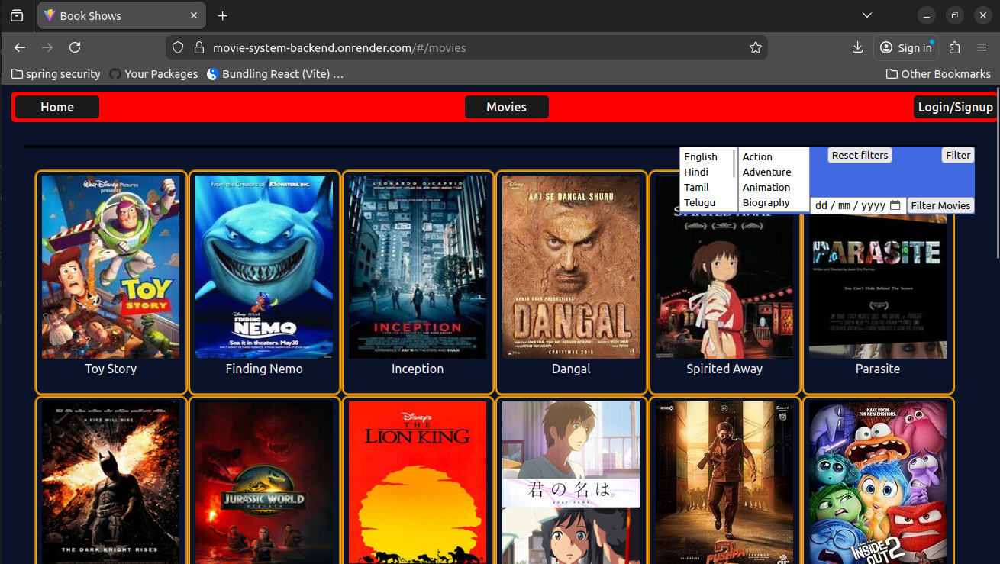

### View movie details
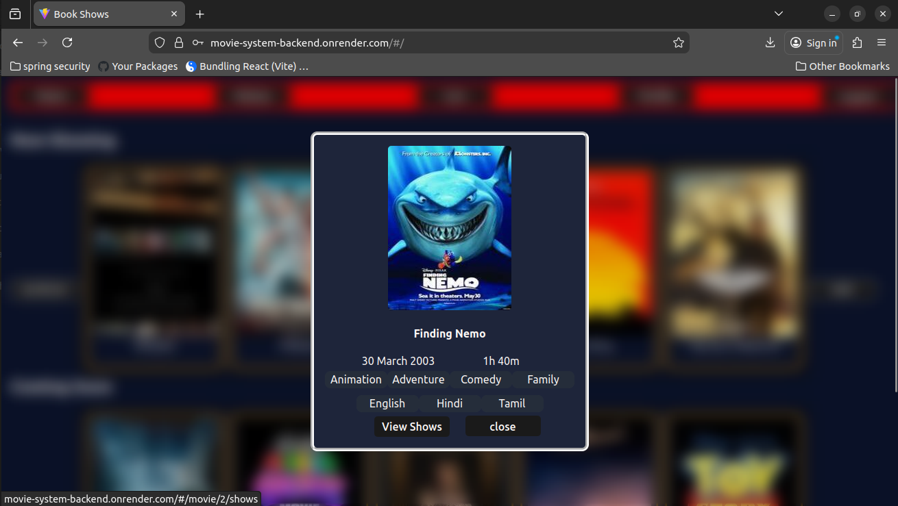

### View shows for a movie


### Login 
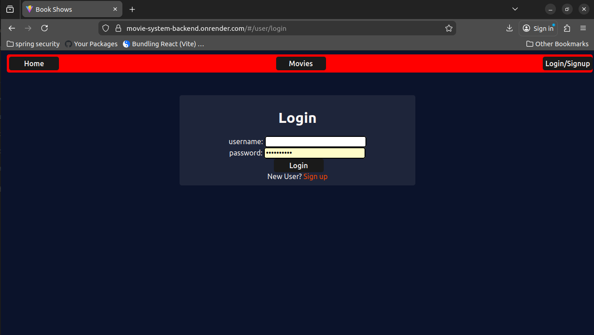

### Sign-up
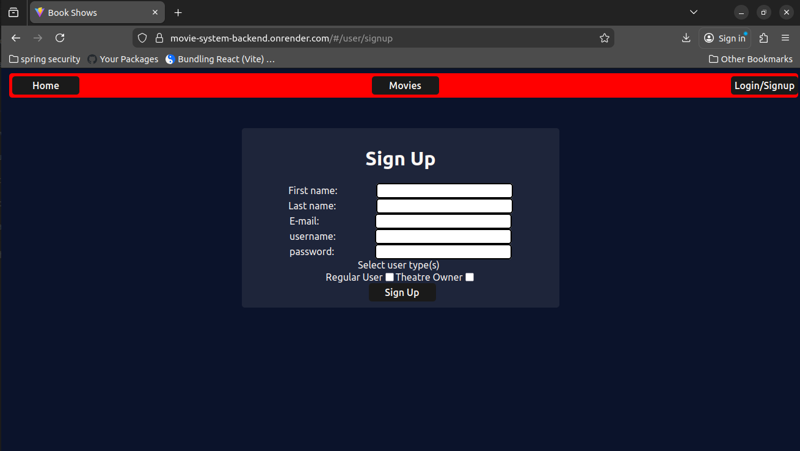

### View seats for a show
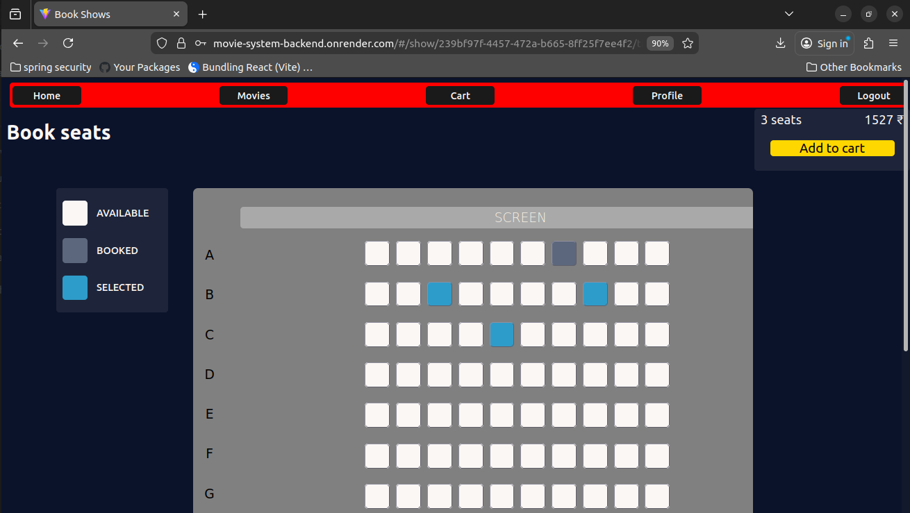

### User cart
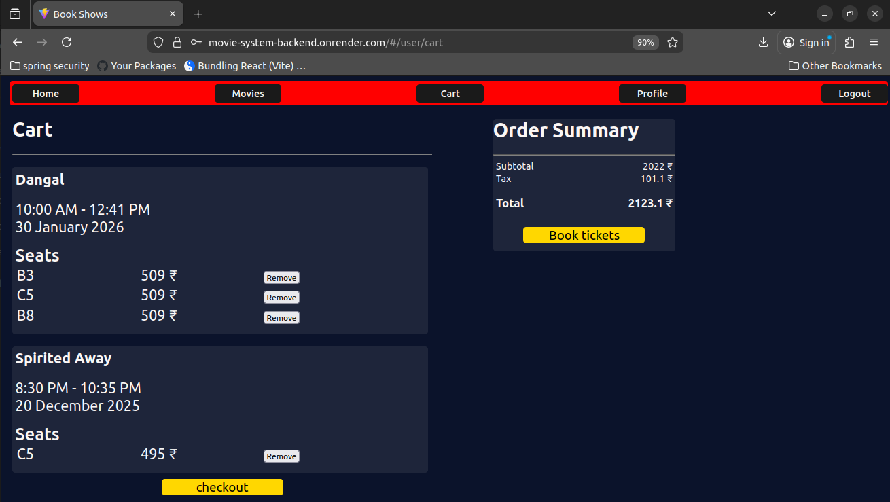

### View upcoming tickets
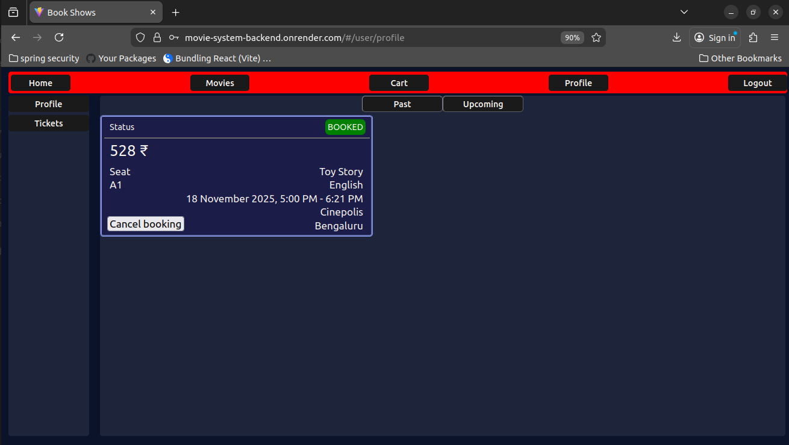

### View past tickets
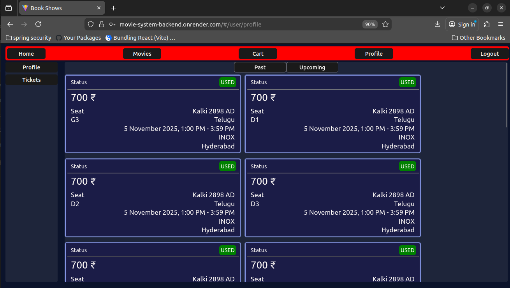

### View theatres controlled by user
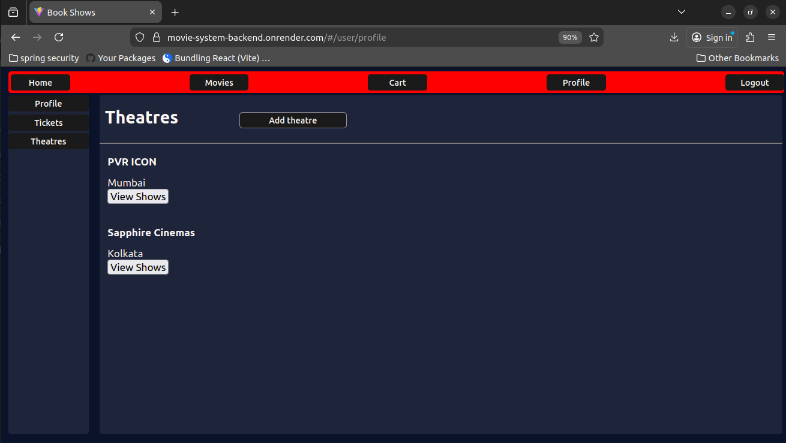

### Create a new theatre
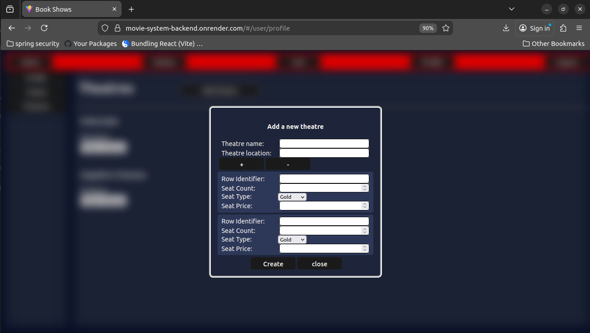

### View ongoing shows in theatre
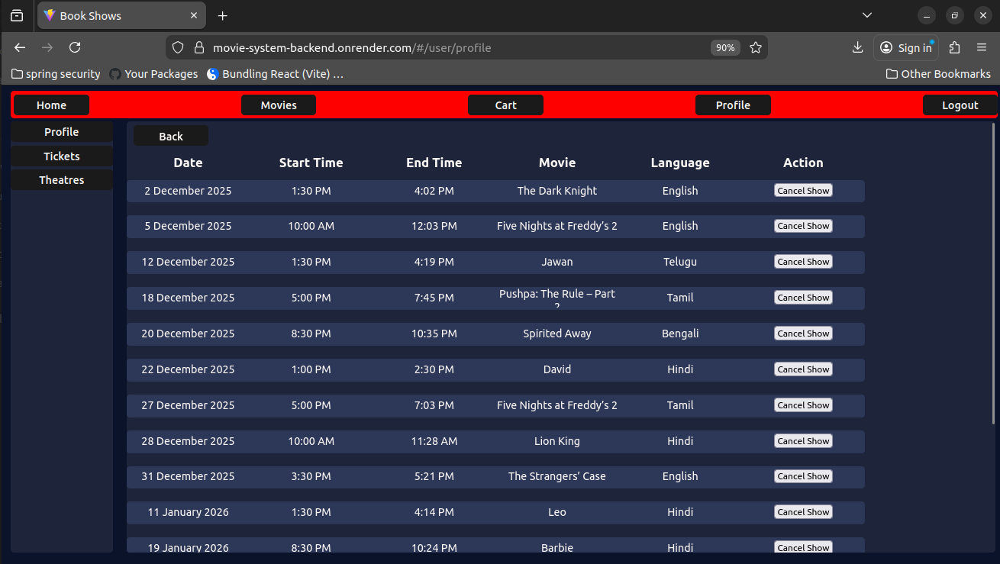


